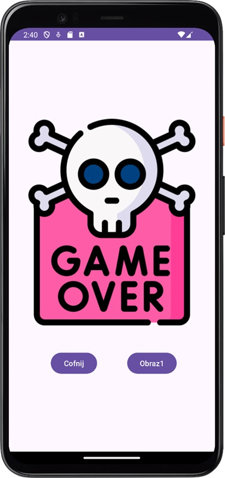

# **Projekt BINGO w Android Studio - JPWP**

## **Cel projektu:**
Celem tego projektu jest stworzenie interaktywnej gry mobilnej, która pomoże użytkownikom w trenowaniu spostrzegawczości i szybkości reakcji. Gry tego typu mogą być przydatne nie tylko dla osób chcących poprawić swoje umiejętności, ale także jako narzędzie edukacyjne dla dzieci i dorosłych.

Dodatkowo, projekt zakłada wykorzystanie platformy Firebase do przechowywania danych, autoryzacji użytkowników i innych funkcji, co pozwoli na zbieranie statystyk związanych z grą oraz rozszerzenie funkcjonalności o tryb wieloosobowy.

## **Zadania:**

### **Zadanie 1:**
Stwórz nowy projekt Empty Views Activity (wybierz język Java) i dodaj trzy przyciski: Obraz1, Obraz2, Obraz3. Sprawdzaj działanie aplikacji w emulatorze.

  

### **Zadanie 2:**
Dodaj funkcjonalność do przycisków Obraz1 i Obraz2, tak aby po kliknięciu w Obraz1 wyświetlał się nowy Layout (nowa aktywność) z wybranym przez ciebie obrazkiem. Tak samo w przypadku przycisku Obraz2 (inny obrazek).

 

### **Zadanie 3:**
Dodaj po dwa przyciski do layoutów Obraz1 i Obraz2: Powrót (zapewniający powrót do głównej aktywności) oraz Obraz1/Obraz2 (przełączający odpowiednio na ten drugi obrazek).

  

### **Zadanie 4:**
Dodaj funkcjonalność do przycisku Obraz3, tak aby po kliknięciu pokazał się jakiś obrazek, ale w tej samej aktywności (wykorzystując metodę setVisibility). Pod obrazkiem powinien znajdować się przycisk "Cofnij" przywracający stan początkowy.

 

